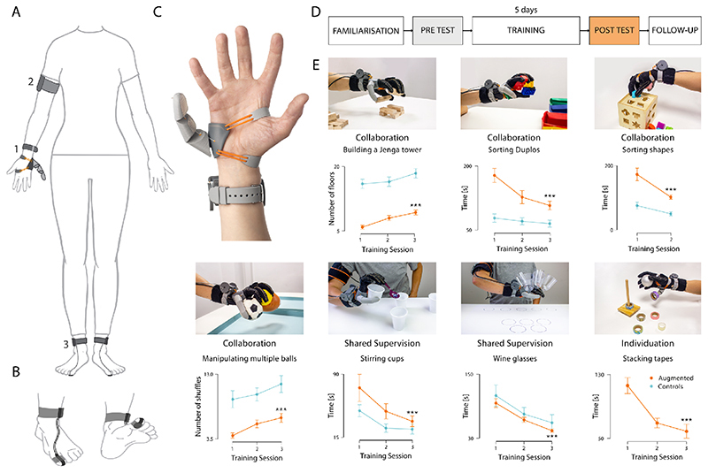

# 一种适用于盲人的AIoT设备

## 目前的AI掌机——小型手机

### Rabbit R1

Rabbit 没有构建 API 让开发者来支持 R1，而是选择了让 R1 适应现有的应用程序。他们开发了 Rabbit OS 系统，让用户可以通过 Rabbit Hole 门户网站直接通向应用程序。在 Rabbit Hole 的门户网站上点击访问 Uber、Spotify、Doordash 等程序的链接。点击链接，之后的操作就和在一个新设备上登录 App 类似。登录成功后，Rabbit OS 就能代表你来执行操作。

相比手机，在 R1 用 Spotify 听歌有新功能：

它不仅能查询歌曲，查询歌词的作者，甚至还能知道有哪只乐队采样了这首歌。

不用在评论区寻觅「知音」，R1 就能陪你聊听歌的感受。

点外卖也将有新体验，不需要手动输入一长串地址，也不需要一项一项地选择「多冰、少冰还是去冰」，只需动动嘴，外卖小哥就已经接单了。

像策划旅行这种要用到多款 App 的活动，现在只需要向它完整地提出需求，机票、景区的门票、路线导航、具体的行程安排，R1 都能一站式搞定。如果觉得行程安排太「特种兵」，向它提需求还能变成休闲游。

### AI Pin

### 评价

#### AI Pin 

只要稍微对可穿戴设备的能量消耗存在敏感度的话，就会意识到这东西的功耗巨大而能坚持的时间巨少。

The Ai Pin has a battery within the computing unit, giving it four hours of battery life. It comes with a standard external battery pack bringing run time up to about nine hours. The external battery pack uses wireless charging and fastens to the Ai Pin with magnets. This configuration allows the battery to act as a fastener, with the computer on the front of a layer of clothing and the battery on the other side.Ai Pin 的计算单元内装有电池，续航时间为 4 小时。它配有一个标准的外置电池组，可将续航时间延长至约 9 小时。外置电池组使用无线充电，并用磁铁固定在 Ai Pin 上。这种配置可以让电池充当紧固件，将电脑放在一层衣服的正面，电池放在另一面。

据说这个可以续航4h，通过电池夹AI Pin可以9h。

但实际上，这个9h肯定是有待考量的。尤其是它包含了摄像头、esim卡的无线网络传输和放在胸上的“扬声器”和掌纹显示。持续使用时间肯定较短。

投影仪投影在粗糙的手上，显示效果必然与周围环境息息相关。

我目前没找到它的测评。但确实对此不够看好。

#### Rabbit R1

**Rabbit R1 有相似性，而且更掌机了。这会让我们产生疑惑，如果目的只是为了减少过多的信息流专注于生活，那我开发一个基于大语言模型的手机端APP，与它对话就可以直接完成类似的操作，岂不是更好。**

Rabbit R1 其实并没有逃脱出手机的设计思路。

**而我认为未来的可穿戴AI设备一定是分离式的**，比如华为的星闪科技，像蓝牙一样把各设备结合起来共同使用。

**我想指出一些可行的，小团队（两个披萨原则，不低于3人不高于10人）可以完成的AIoT设备创想。**如，**一种适用于盲人、视障群体的AIoT设备的可能性**。

## 人脑的可适应性

> https://www.ncbi.nlm.nih.gov/pmc/articles/PMC7612043/

要明白这个问题，让我们从理解人脑的可适应性开始。这是一个赛博第6指，由受试者的脚趾控制。

实验人员适应之后大脑会很熟练地去操作这个手指去和五指联动。论文其实说明了人脑的适配性非常强，外接设备自适应安装运行插件那种。类似的研究还有给你戴翻转的眼镜(或者看显微镜看久了)，大脑适应之后会直接给你处理为正向的。

这个手指相当于筷子，你用筷子的时候大脑会思考吗？不会。

比如你打原神，前后左右移动，放技能，都不会去过多思考。但是你刚玩一款游戏的时候，就会看键位，大脑适应的一个过程。而且这种学习是可以迁移的，上下左右虽然在电脑和手机都不一样，但是操作久了人们的控制就是潜意识的啦。而且游戏玩多了学习成本会降低，触类旁通。

用脚趾进行控制，因为测脑电还是精度很低成本很高的，但是用脚趾控制，后面他们还去给志愿者看核磁共振，大脑出现了新的活跃区域去控制这第6个手指,这个新的区域是别人没有的，也不属于手指脚趾控制的区域。

很有意思的东西。这代表着其实我们不需要直接的脑机接口就能完成大脑的控制。此前有一个非常火的手术就证明了这点。

在这种情况下，我们可以用大脑去做一些缺陷的弥补。

## 你听过交响乐吗？

管弦乐、交响乐等等音乐，即使我们闭上了眼睛也能感觉出哪里传来了什么声音，什么时候是激昂的，什么时候是平静的，低音从哪个方位来，高音从哪个方位来，什么时候有共振，什么时候有拍。

换句话说，声音其实可以传达**位置信息、（乐器）类型信息、音调信息、情绪信息**。

**那么能不能通过某种方式，将眼睛看到的画面转换为一种声音信息呢？**

不一定是传达真实的空间关系，能不能把眼睛中能看到的“尖锐的危险物品”、“路径基本规划”、“美好的大自然的风景”、“前方盲道有坑”转化为一种**实时播放的音乐**呢？

## 基本设想

硬件设备：

1. 独立的耳机，体积较小，续航较长，可以先用最普通的蓝牙进行设备连接（可以用现成的，但要求具有听环境音的功能）（建议就用现成的，发现效果不好再换）
2. 随身携带的摄像头或者雷达或者能做视觉识别的东西，和控制器（比如以马甲的形式套在衣服外面，穿在身上，和控制器连在一起）

适配软件需求：

1. 视觉识别应用（应该有很多很多开源的东西，具体如何实现和算力如何布局可听专业人士安排）
2. **将识别到的视觉转换成音乐的AI**

人会抖动，会位移，视觉该怎么做（比如根据历史视觉信息搭建一个固有的不变的空间模型，用当前视觉识别结果做补充）（比如增加物理传感器判断人类姿态，根据姿态反向消除这种影响）（比如在活动频繁区域增加其它视觉辅助设备，比如房间增加固定的摄像头）

实际上，在项目初期，只需要完成**“将识别到的视觉实时转换成音乐的AI”**即可，其他的内容相对而言有比较成熟的应用了，不太需要操心。

但这会产生一些关键的问题：

1. 怎么判断“识别到的视觉实时转换成音乐的AI”足够好，比如先根据交响乐的设定人为规定一些专家规则，比如尖锐的危险的东西会有一个音量高昂的女孩子
2. 创造一个无画面的但有障碍的游戏，训练另一个AI通过听声音来进行障碍的躲避。
3. 
4. 先把人的眼睛蒙上，放
5. 在一个含虚拟障碍物的空间，

